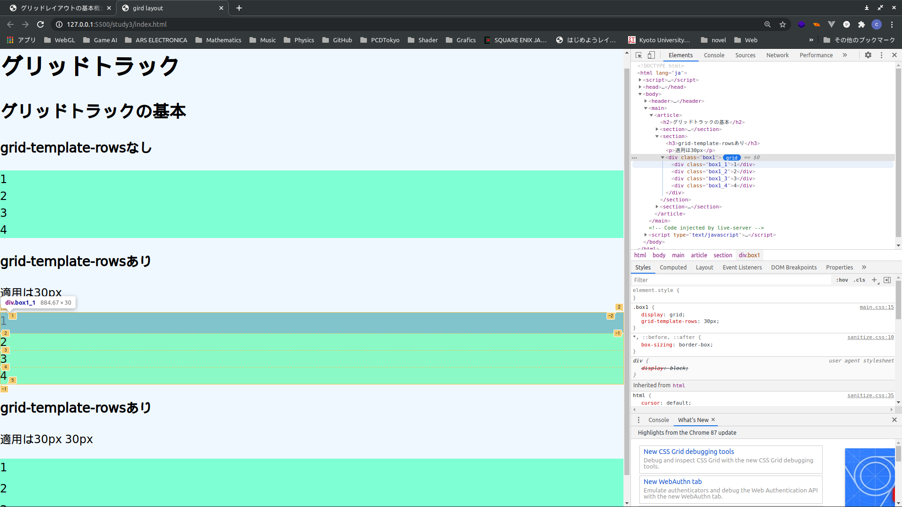
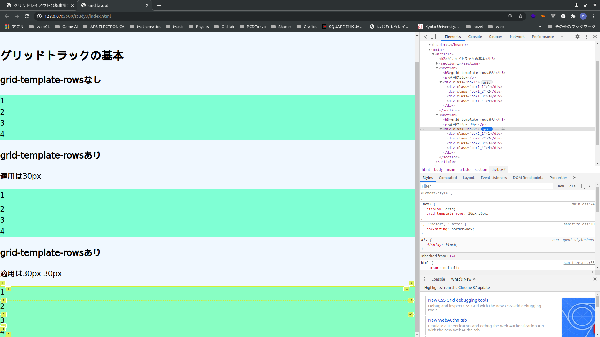

# グリッドレイアウト

## グリッドコンテナー

グリッドコンテナーの作成を指定します。
直接の子要素がグリッドアイテムに変わります。

適用するにはdisplay: grid

```html
<div class="box">
    <div class="box1">1</div>
    <div class="box2">2</div>
    <div class="box3">3</div>
    <div class="box4">4</div>
</div>
```

```css
.box {
    display: grid;
}
```

見た目は変わらない各ブラウザの開発者ツールから確認できます。

chromeの場合


ソースコードは**study1**にあります。

### グリッドトラック

 **grid-template-columns**と**grid-template-rows**プロパティを使って行列を作成します。これがグリッドトラックの定義をします。そもそもグリッドトラックとは、グリッド上の任意の2本の線にあるスペースのことです。

**grid-template-columns**プロパティで列トラックのサイズが定義できます。

#### 200pxでの適用

```html
<section>
    <h3>grid-template-columnsあり</h3>
    <p>適用は200px</p>
    <div class="box1">
        <div class="box1_1">1</div>
        <div class="box1_2">2</div>
        <div class="box1_3">3</div>
        <div class="box1_4">4</div>
    </div>
</section>
```

```css
.box1 {
    display: grid;
    grid-template-columns: 200px;
}
```

画像を見ると200pxになっているのがわかる。


#### 200px 200pxでの適用

```html
<section>
    <h3>grid-template-columnsあり</h3>
    <p>適用は200px 200px</p>
    <div class="box2">
         <div class="box2_1">1</div>
         <div class="box2_2">2</div>
         <div class="box2_3">3</div>
         <div class="box2_4">4</div>
    </div>
</section>
```

```css
.box2 {
    display: grid;
    grid-template-columns: 200px 200px;
}
```

画像を見ると200px 200pxになっているのがわかる。


4つすべて揃えるにはどうすればよいか？

```css
grid-template-columns: 200px 200px 200px 200px;
```

にすれば良い。

ソースコードは以下です。**HTML and CSS**

[grid-template-columnsでの実装](study2/index.html)

**grid-template-rows**で行の定義が可能です。

#### 30pxでの適用

```html
<section>
    <h3>grid-template-rowsあり</h3>
    <p>適用は30px</p>
    <div class="box1">
        <div class="box1_1">1</div>
        <div class="box1_2">2</div>
        <div class="box1_3">3</div>
        <div class="box1_4">4</div>
    </div>
</section>
```

```css
.box1 {
    display: grid;
    grid-template-rows: 30px;
}
```

画像を見ると30pxになっているのがわかる。




#### 30px 30pxでの適用

```html
 <section>
    <h3>grid-template-rowsあり</h3>
    <p>適用は30px 30px</p>
    <div class="box2">
        <div class="box2_1">1</div>
        <div class="box2_2">2</div>
        <div class="box2_3">3</div>
        <div class="box2_4">4</div>
    </div>
</section>
```

```css
.box2 {
    display: grid;
    grid-template-rows: 30px 30px;
}
```

1と2が30px 30pxになっているのがわかる。



4つすべて揃えるには

```css
grid-template-rows: 30px 30px 30px 30px
```

とすれば良いです。

ソースコードは以下です。**HTML and CSS**

[grid-template-rowsでの実装](study3/index.html)

#### grid-template-columnsとgrid-template-rowsを組み合わせて使う

200px * 30pxで作成。

ソースコードは以下です。**HTML and CSS**

[grid-template-columns_and_grid-template-rowsでの実装](study4/index.html)

## fr単位

fr単位はグリッドコンテナー内の利用可能な空間の分数を表している。

### 例1 1frの場合

grid-template-columnsとgrid-template-rows両方に適用してみる。

とくに変化は起きない。

```css
.box0 {
    display: grid;
    grid-template-columns: 1fr;
    grid-template-rows:  1fr;
}
```

### 例2 1fr 1frの場合

まずはじめに**grid-template-columnsのみに適用**してみる。

```css
.box1c {
    display: grid;
    grid-template-columns: 1fr 1fr;
}
```

結果として番号2が番号1の横に来て見た目が若干変わった。

次に**grid-template-rowsのみに適用**してみる。

```css
.box1r {
    display: grid;
    grid-template-rows: 1fr 1fr;
}
```


結果はあまり見た目が変わらない、なぜだろう？

なぜgrid-template-columnsは変わってgrid-template-rowsは見た目が変わらないのだろう。-> わからないので次に行く

[fr単位の例](study5/index.html)

### 例3. 2fr 1frの場合と2fr 2frの場合

2fr 1frの場合にgrid-template-columnsのみに適用した場合のコードは以下となる。

```css
.box2_1_c {
    display: grid;
    grid-template-columns: 2fr 1fr;
}
```

```css
.box2_2_c {
    display: grid;
    grid-template-columns: 2fr 2fr;
}
```


明らかにこの2つは異なる、2fr 1frの場合は左右のバランスが偏っている。右は左の2倍の大きさになっている。しかし2fr 2frの場合は数が同じなのでバランスは良い。

<!--これを利用して何か作りたい-->