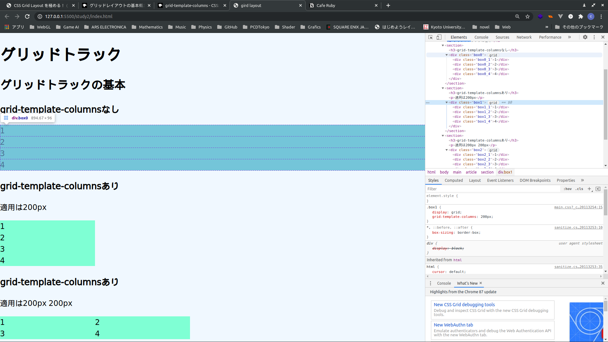
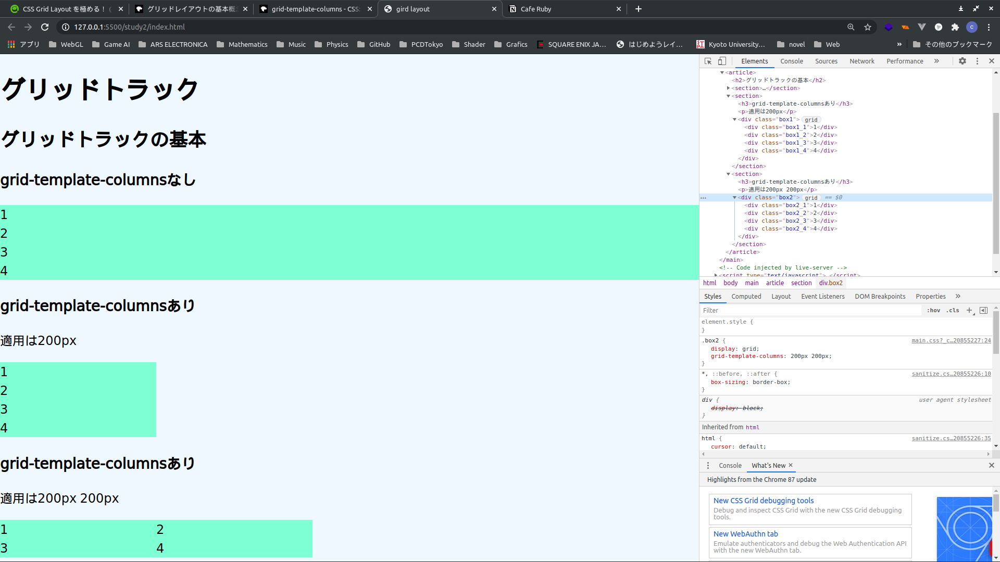

# グリッドレイアウト

## グリッドコンテナー

グリッドコンテナーの作成を指定します。
直接の子要素がグリッドアイテムに変わります。

適用するにはdisplay: grid

```html
<div class="box">
    <div class="box1">1</div>
    <div class="box2">2</div>
    <div class="box3">3</div>
    <div class="box4">4</div>
</div>
```

```css
.box {
    display: grid;
}
```

見た目は変わらない各ブラウザの開発者ツールから確認できます。

chromeの場合



ソースコードは**study1**にあります。

### グリッドトラック

 **grid-template-columns**と**grid-template-rows**プロパティを使って行列を作成します。これがグリッドトラックの定義をします。そもそもグリッドトラックとは、グリッド上の任意の2本の線にあるスペースのことです。

**grid-template-columns**プロパティで列トラックのサイズが定義できます。

#### 200pxでの適用

```html
<section>
    <h3>grid-template-columnsあり</h3>
    <p>適用は200px</p>
    <div class="box1">
        <div class="box1_1">1</div>
        <div class="box1_2">2</div>
        <div class="box1_3">3</div>
        <div class="box1_4">4</div>
    </div>
</section>
```

```css
.box1 {
    display: grid;
    grid-template-columns: 200px;
}
```

画像を見ると200pxになっているのがわかる。


#### 200px 200pxでの適用

```html
<section>
    <h3>grid-template-columnsあり</h3>
    <p>適用は200px 200px</p>
    <div class="box2">
         <div class="box2_1">1</div>
         <div class="box2_2">2</div>
         <div class="box2_3">3</div>
         <div class="box2_4">4</div>
    </div>
</section>
```

```css
.box2 {
    display: grid;
    grid-template-columns: 200px 200px;
}
```

画像を見ると200px 200pxになっているのがわかる。



4つすべて揃えるにはどうすればよいか？

```css
grid-template-columns: 200px 200px 200px 200px;
```

にすれば良い。
