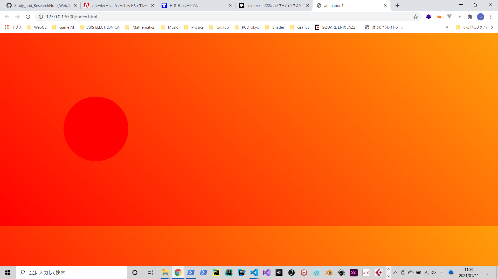

## 2. アニメーション

色は原則HSL -> RGBに変換する

### 2.1 色を変える 

背景に少し溶け込むような感じでうっすら色を塗っていく感じ

```xml
  <svg viewBox="0 0 512 512" width="512" height="512" id="animation0">
    <circle id="circle_test" cx="256" cy="256" r="100" fill="#000000"></circle>
  </svg>
```

```js
const get_id = document.querySelector("#circle_test");
let time = 0;

let step = () => {
  time += 0.1;

  get_id.style.fill = `hsl(150, 100%, ${time}%)`;
  if(time < 50){
    requestAnimationFrame(step);
  }

  console.log(time);
}

let main = () => {
  step();
}

main();
```


### 2.2 完全に溶け込むように色を変えるにはどうしたらよいか?

```xml
<svg viewBox="0 0 512 512" width="512" height="512" id="animation0">
  <circle id="circle_test" cx="256" cy="256" r="100" fill="#000000"></circle>
</svg>
```

```css
body {
  background-image: linear-gradient(-135deg,#ff9d09, #ff0000);
}
```

```js
const get_id = document.querySelector("#circle_test");
let time = 0;

let step = () => {
  time += 0.1;

  get_id.style.fill = `hsl(0, 100%, ${time}%)`;
  if(time < 50){
    requestAnimationFrame(step);
  }

  console.log(time);
}

let main = () => {
  step();
}

main();
```


